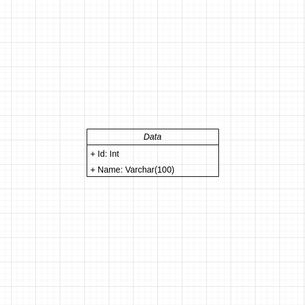

# Proyecto final
## Índice
1. [Arquitectura de software](#arquitectura-de-software)
    1. [Descripción general](#descripción-general)
    2. [Componentes de la aplicación](#componentes-de-la-aplicación)
    3. [Estructura de carpetas](#estructura-de-carpetas)
    4. [Modelo de datos](#modelo-de-datos)
2. [Ejecución del proyecto en local](#ejecución-del-proyecto-en-local)
    1. [Requisitos](#requisitos)
    2. [Instrucciones para ejecutar el proyecto](#instrucciones-para-ejecutar-el-proyecto)
        1. [Primera vez que se ejecuta el proyecto](#primera-vez-que-se-ejecuta-el-proyecto)
        2. [Actualizar archivos del contenedor de nuestra aplicación](#actualizar-archivos-del-contenedor-de-nuestra-aplicación)
3. [Modelo de colaboración](#modelo-de-colaboración)
4. [Tests](#tests)

## Arquitectura de software
En esta sección describiremos la arquitectura de software de esta aplicación de Python con Flask y PostgreSQL, que expone una API semántica.

### Descripción general
Para guardar los datos utlizamos SQLAlchemy que nos proporciona clases para definir el modelo de datos y nos abstraen de realizar consultas SQL. Estas clases se les conocen como Modelos, estas clases nos permiten a través de código modificar los datos que almacenamos en la base de datos.

De base de datos utlizamos PostgreSQL.

Para desarrollo local y para despliegues a producción utlizamos Docker para poder crear diferentes versiones del código en cada integración a la rama `main`.

Nuestra tecnología de despliegues automatizados se basa en Jenkins que reacciona a los cambios que hagamos en nuestro repositorio de Github. Nuestro proceso de despliegues consiste en:
1. Clonamos el repositorio en Jenkins
2. Ejecutamos los tests del proyecto
3. Ejecutamos flake8 como herramienta de lintado
4. Construimos la imagen de Docker para producción
5. Subimos la imagen de Docker a Docker Hub

### Componentes de la aplicación
Nuestra aplicación se compone de los diferentes componentes:
- Rutas: las rutas especifican las URLs de la API y además contienen la lógica de negocio
- Modelos: los modelos definen el modelo de datos de la aplicación y su relación entre cada elemento
- Configuración: en nuestro archivo `config.py` tenemos definidas las configuraciones de la aplicación para los entornos `development` y `production`

### Estructura de Carpetas
El proyecto sigue una estructura de carpetas organizada para mantener un código limpio y modular. A continuación se detalla la estructura de carpetas principal:
```
/
├── app/
│   ├── tests/
│   ├── models.py
│   ├── routes.py
│   ├── __init__.py
│   └── config.py
├── docker-compose.yaml
├── Dockerfile
├── Dockerfile.development
├── manage.py
├── manage.sh
├── requirements.txt
└── run.py
└── run.sh
```

- `app/`: contiene el código de nuestra aplicación
    - `tests/`: contiene los tests de cada archivo dentro de la carpeta `app/`
    - `models.py`: contiene los modelos de datos utilizados por nuestra aplicación
    - `routes.py`: contiene las rutas de nuestra API semántica
    - `__init__.py`: contiene las funciones que configura nuestra aplicación al ejecutarse por primera vez
    - `config.py`: contiene las configuraciones de nuestra aplicación
- `docker-compose.yaml`: describe los servicios necesarios para ejecutar nuestra aplicación en local
- `Dockerfile`: contiene las instrucciones para construir una imagen de Docker para producción
- `Dockerfile.development`: contiene las instrucciones para construir una imagen de Docker para desarrollo local
- `manage.py`: código que crea la base de datos en postgre y todas las tablas necesarias para que la aplicación funcione
- `manage.sh`: setea como variable de entorno la URL de base de datos y qué entorno de desarrollo usará para ejecutar el archivo `manage.py`
- `requirements.txt`: contiene la lista de dependencias de nuestra API
- `run.py`: contiene el código que levanta nuestra API
- `run.sh`: utilidad de bash que nos permite ejecutar comandos de python dentro de nuestro contenedor en ejecución

### Modelo de datos
En este diagrama se ve reflejado el modelo de datos de nuestra aplicación



## Modelo de colaboración
Nosotros seguimos el modelo de ramas basado en features, que implica que cada desarrollador trabaja en su propia rama de features hasta que termine de implementar la nueva funcionalidad. Estas ramas de features se integran a través de pull requests en Github.

Estas son las normas que seguimos para poder dar por válida una feature:
- Cada nueva funcionalidad tiene que estar cubierta por tests
- La cobertura de los tests tiene que ser del 80% como mínimo
- El estilo de código a seguir es PEP 8. Puedes hacer uso de la herramienta `flake8` para comprobar los errores de estilo
- Solo se integran ramas a `main` después de una revisión de código por parte de otro desarrollador

## Ejecución del proyecto en local
### Requisitos
Para poder ejecutar este proyecto tienes que tener instalado:
- Docker ([instalación](https://docs.docker.com/engine/install/))

### Instrucciones para ejecutar el proyecto
Nosotros usamos Docker Compose para desarrollar localmente. Al ejecutar por primera vez el proyecto con Docker Compose se construirá una imagen de Docker para local. El Dockerfile que usará es `Dockerfile.development`

El comando para ejecutar el proyecto es:
```bash
docker compose up
```

#### Primera vez que se ejecuta el proyecto
Si es la primera vez que ejecutamos el proyecto tendrás que inicializar la base de datos ejecutando el archivo manage.py de la siguiente forma:
```bash
./run.sh python3 manage.py
```
Lo que hace el comando es entrar dentro del contenedor de nombre `proyecto_final_app` y ejecuta el comando `python3 manage.py`

Con esto ya tendremos inicializada la base de datos con las tablas creadas.

#### Actualizar archivos del contenedor de nuestra aplicación
Cada vez que hagas un cambio en la aplicación Docker Compose se actualizará para servir los nuevos ficheros ya que montamos un volumen de la carpeta local con la carpeta /app dentro del contenedor de Docker
> [!WARNING]
> Sí después de cambiar los archivos del proyecto no se ve reflejado en el contenedor de Docker, entonces tendrás que parar la ejecución y reconstruir la imagen de Docker para desarrollo con el comando:

```
docker compose up --build
```

El argumento `--build` forzará a recontruir las imágenes de Docker que usa nuestro fichero `docker-compose.yaml`

## Tests
Nuestra aplicación utiliza pytest para lanzar los tests unitarios que prueban los endpoints de nuestra API. Para ejecutarlos puedes usar el siguiente comando:
```
./run pytest
```

Si quieres crear un reporte de covertura de tests tienes que lanzar los siguientes comandos:
```
./run coverage run -m pytest
./run coverage report
```

El primer comando crea un fichero `.coverage` que contiene los resultados de lanzar el primero comando. El segundo comando lo que hace es leer de este fichero para mostrar una tabla con todos los archivos de nuestro código, excluyendo los archivos de tests, para mostrar que porcentaje de código nuestros tests cubre que contiene los resultados de lanzar el primero comando. El segundo comando lo que hace es leer de este fichero para mostrar una tabla con todos los archivos de nuestro código, excluyendo los archivos de tests, para mostrar que porcentaje de código nuestros tests cubren.

## Lintado
Para mantener los estándares del estilo del código utilizamos la librería `flake8`. Para hacer un análisis del código para ver si se sigue el estándar PEP 8, ejecuta el siguiente comando:
```bash
./run.sh flake8
```
Esto te devolverá las líneas que no se adhieren al estándar junto con la explicación.
